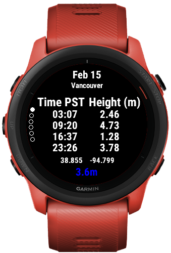

# BC Tides

A Garmin Connect IQ Widget App for Tides in British Columbia.

## Features

Support for all tide stations that provide tide predictions in British Columbia.

Glance, graph, and table views:

## Permissions

The following permissions are required for complete functionality of the app:
 * Background
   - Used to automatically download tide station data on a regular schedule in the background. 
 * Communications
   - Used to obtain tide data from the online APIs, see [Data Sources](#data-sources).
 * Positioning
   - Used to find the tide stations nearest to your current position.

## Device Support

This app was primarily designed with the Forerunner 745 in mind.  However, the following devices are all supported, but may not all provide the same quality of experience:

 * Approach® S70 (42mm)
 * Approach® S70 (47mm)
 * Captain Marvel
 * D2™ Air
 * D2™ Air X10
 * D2™ Delta
 * D2™ Delta S
 * D2™ Mach 1
 * D2™ Mach 1 Pro
 * Darth Vader™
 * Descent™ MK2, Descent™MK2i
 * Descent™ MK3 (43mm)
 * Descent™ MK3 (51mm)
 * Descent™ Mk2S
 * Enduro™
 * Enduro™ 2
 * First Avenger
 * Forerunner® 165
 * Forerunner® 165 Music
 * Forerunner® 245
 * Forerunner® 245 Music
 * Forerunner® 255
 * Forerunner® 255 Music
 * Forerunner® 255S
 * Forerunner® 255S Music
 * Forerunner® 265
 * Forerunner® 265S
 * Forerunner® 55
 * Forerunner® 645
 * Forerunner® 645 Music
 * Forerunner® 745
 * Forerunner® 935
 * Forerunner® 945
 * Forerunner® 945 LTE
 * Forerunner® 955, Forerunner® 955 Solar
 * Forerunner® 965
 * MARQ® (Gen 2), MARQ® Carbon Collection
 * MARQ® Commander (Gen 2) – Carbon Edition
 * MARQ™ Adventurer
 * MARQ™ Athlete
 * MARQ™ Aviator
 * MARQ™ Aviator (Gen 2)
 * MARQ™ Captain, MARQ™ Captain: American Magic Edition
 * MARQ™ Commander
 * MARQ™ Driver
 * MARQ™ Expedition
 * MARQ™ Golfer
 * Mercedes-Benz Venu®
 * Mercedes-Benz Venu® 2
 * Mercedes-Benz Venu® 2S
 * Rey™
 * Venu®
 * Venu® 2
 * Venu® 2 Plus
 * Venu® 2S
 * Venu® 3
 * Venu® 3S
 * Venu® Sq.
 * Venu® Sq. 2
 * Venu® Sq. 2 Music
 * Venu® Sq. Music
 * epix™ (Gen 2), quatix® 7 – Sapphire Edition
 * epix™ Pro (42mm)
 * epix™ Pro (47mm), quatix® 7 Pro
 * epix™ Pro (51mm)
 * fēnix® 5, quatix® 5
 * fēnix® 5 Plus
 * fēnix® 5S
 * fēnix® 5S Plus
 * fēnix® 5X, tactix® Charlie
 * fēnix® 5X Plus
 * fēnix® 6
 * fēnix® 6 Dual Power
 * fēnix® 6 Pro, fēnix® 6 Sapphire
 * fēnix® 6 Pro Dual Power
 * fēnix® 6 Pro Solar
 * fēnix® 6 Solar
 * fēnix® 6S
 * fēnix® 6S Dual Power
 * fēnix® 6S Pro, fēnix® 6S Sapphire
 * fēnix® 6S Pro Dual Power
 * fēnix® 6S Pro Solar
 * fēnix® 6S Solar
 * fēnix® 6X Pro, fēnix® 6X Sapphire, fēnix® 6X Pro Solar, tactix® Delta Sapphire, quatix® 6X Solar, tactix® Delta Solar, tactix® Delta Solar Ballistics
 * fēnix® 7, quatix® 7
 * fēnix® 7 Pro, fēnix® 7 Pro – Solar Edition, fēnix® 7 Pro – Sapphire Solar Edition
 * fēnix® 7 Pro – Solar Edition (No Wi-Fi®)
 * fēnix® 7S, fēnix® 7S– Solar Edition, fēnix® 7S– Sapphire Solar Edition
 * fēnix® 7S Pro, fēnix® 7S Pro– Sapphire Solar Edition
 * fēnix® 7X, fēnix® 7X - Solar Edition, fēnix® 7X– Sapphire Solar Edition, quatix® 7X – Solar Edition
 * fēnix® 7X Pro, fēnix® 7X Pro– Sapphire Solar Edition
 * fēnix® 7X Pro No Wi-Fi
 * fēnix® Chronos
 * quatix® 6
 * quatix® 6X, quatix® 6X Solar, quatix® 6X Dual Power
 * tactix® 7, tactix® 7 – Pro Ballistics Edition, tactix® 7 – Pro Edition
 * tactix® 7 – AMOLED Edition
 * vívoactive® 3 Music
 * vívoactive® 4
 * vívoactive® 4S, GarminActive S
 * vívoactive® 5

## Language Support

The main language is English.  A Google-translate version of French localization strings is included as well.

## Data Sources
List of tide stations:
https://tides.gc.ca/en/stations

API documentation:
https://api.iwls-sine.azure.cloud-nuage.dfo-mpo.gc.ca/swagger-ui/index.html

## Disclaimer
The product names, logos, brands, and other trademarks referred to within this
project are the property of their respective trademark holders.  This project
is not affiliated with, sponsored by, or endorsed by Garmin.

This code and application are provided "as is" and for informational purposes.
All information is provided with no guarantee of completeness, accuracy,
timeliness or of the results obtained from the use of this information, and
without warranty of any kind, express or implied, including, but not limited to
warranties of performance, merchantability and fitness for a particular purpose.

The author will not be liable to you or anyone else for any decision made or
action taken in reliance on the information given by the code or application or
for any consequential, special or similar damages, even if advised of the
possibility of such damages.  
