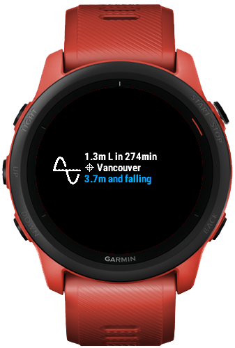
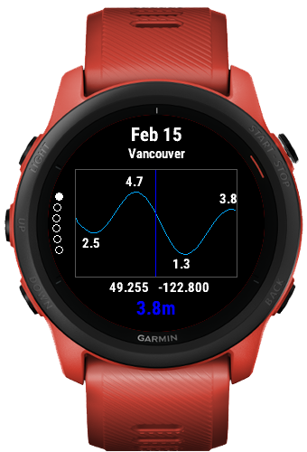

# BC Tides

A Garming Connect IQ Wdiget App for Tides in British Columbia.

Example images:

## Permissions

Communications
Positioning

## Device Support

Support for Forerunner 745 only at this time.

## Data Sources

List of tide stations:
https://tides.gc.ca/en/stations

API documentation:
https://api.iwls-sine.azure.cloud-nuage.dfo-mpo.gc.ca/swagger-ui/index.html
